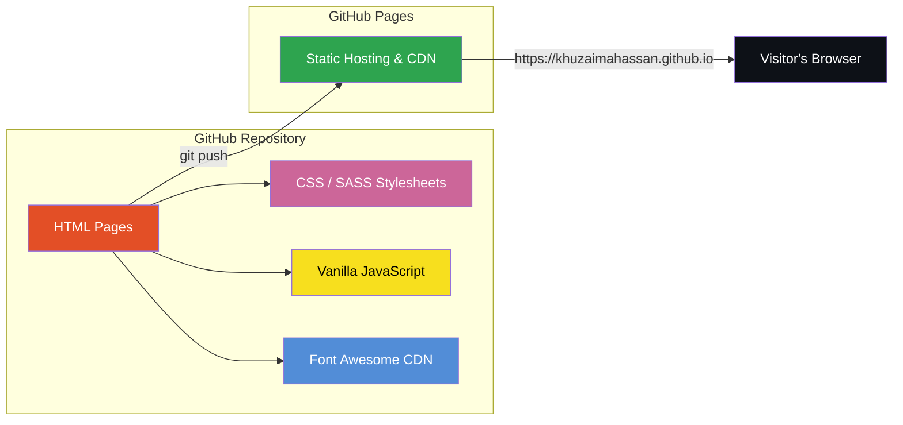

<](https://khuzaimahassan.github.io)
[](https://developer.mozilla.org/en-US/docs/Web/HTML)
[](https://sass-lang.com/)
[](https://developer.mozilla.org/en-US/docs/Web/JavaScript)
[](https://fontawesome.com/)
[](LICENSE)

</div>

---

## 📌 Problem

Building a strong online presence as an AI / ML professional requires more than a résumé — it demands a living, interactive showcase of projects, skills, certifications, and services. Generic portfolio templates rarely convey the depth of technical work in data engineering, deep learning, and agentic AI systems. This portfolio solves that gap by providing a fast, fully static website that is easy to maintain, costs nothing to host, and is tailored to highlight the breadth and depth of my work.

---

## 🛠️ Tech Stack

| Layer | Technology |
|---|---|
| **Markup** | HTML5 |
| **Styling** | CSS3 / SASS |
| **Scripting** | Vanilla JavaScript |
| **Icons** | Font Awesome |
| **Hosting** | GitHub Pages |

---

## 🏗️ Architecture

The site follows a clean, static front-end architecture — no build tools, no frameworks, just fast-loading pages served directly from GitHub Pages.



**Page Map**

```
/
├── index.html          # Home — hero, intro, call-to-action
├── about.html          # About — background, education (NED University)
├── projects.html       # Projects — featured AI/ML case studies
├── resume.html         # Resume — experience & skills overview
├── certifications.html # Certifications — verified credentials
└── contact.html        # Contact — form / social links
```

---

## 🔗 Demo

👉 **Live Site:** [https://khuzaimahassan.github.io](https://khuzaimahassan.github.io)

---

## ✨ Features

### 🗂️ Pages

| Page | Highlights |
|---|---|
| **Home** | Hero section, quick bio, call-to-action buttons |
| **About** | Education (NED University), career summary |
| **Projects** | Filterable project cards with descriptions & links |
| **Resume** | Downloadable résumé, skills chart |
| **Certifications** | Verified badges and credential links |
| **Contact** | Contact form and social media links |

### 🚀 Featured Projects

| Project | Domain |
|---|---|
| **AQI Predictor** | Environmental ML — air quality index forecasting |
| **AI Academic Mentor** | Agentic AI — intelligent tutoring system |
| **Fraud Detection** | Financial ML — anomaly & fraud classification |
| **Data Warehousing** | Data Engineering — ETL pipeline & warehouse design |

### 💼 Services Showcased

- **Data Engineering & ETL** — scalable pipelines, warehouse design, data integration
- **Deep Learning & Forecasting** — time-series models, CNNs, transformers
- **Agentic AI & LLM Systems** — autonomous agents, RAG pipelines, prompt engineering
- **MLOps & Deployment** — CI/CD for ML, containerisation, model monitoring

---

## 🚀 Getting Started

### Prerequisites

Any modern web browser — no build step required.

### Local Development

```bash
# 1. Clone the repository
git clone https://github.com/khuzaimahassan/khuzaimahassan.github.io.git

# 2. Enter the project directory
cd khuzaimahassan.github.io

# 3. Open in your browser (pick one)
#    macOS
open index.html
#    Linux
xdg-open index.html
#    Windows
start index.html
```

> For live-reload during development you can use any static server:
>
> ```bash
> # Using Python
> python -m http.server 8000
>
> # Using Node (npx)
> npx serve .
> ```

### Deployment

Push to the `main` branch — GitHub Pages will automatically build and deploy.

---

## 🤝 Contributing

Contributions, issues, and feature requests are welcome!

1. **Fork** the repository
2. **Create** a feature branch — `git checkout -b feature/awesome-improvement`
3. **Commit** your changes — `git commit -m "Add awesome improvement"`
4. **Push** to the branch — `git push origin feature/awesome-improvement`
5. **Open** a Pull Request

Please open an issue first to discuss major changes.

---

## 📄 License

This project is licensed under the **MIT License** — see the [LICENSE](LICENSE) file for details.

---

<div align="center">

**Built with ❤️ by [Khuzaima Hassan](https://github.com/khuzaimahassan)**

AI / ML Engineer · NED University

</div>
]]>
